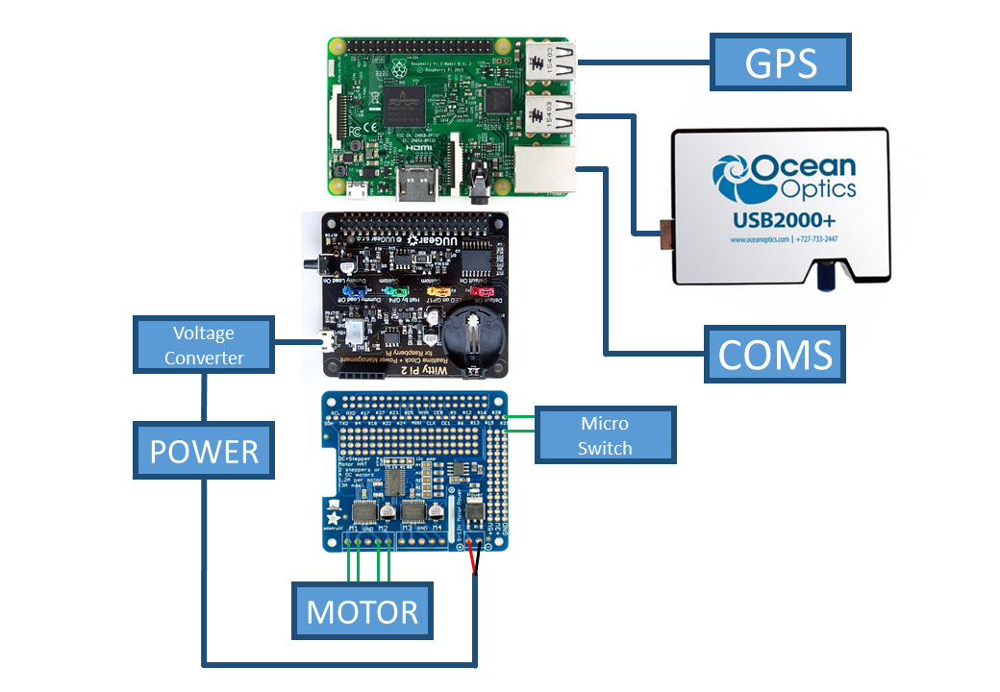

.. _stationsetup:

Station Setup
=============

The station has several core components:

* The control computer
* The spectrometer (and associated optics)
* Power control
* The motor
* GPS (for time keeping)
* Communication

This section will describe the setup and operation of each of these components in the |OpenSO2| scanner.

.. note:: The details below refer to specific components as these are the components with which the |OpenSO2| scanner was developed. These are not the only solutions available, so the station software is designed to be modular so that the specific components used can be changed with relative ease. 

The Control Computer
--------------------

The |OpenSO2| software has been designed to work on a Raspberry Pi single board computer (specifically the RPI 3B+). This controls the different components and analyses the collected data in real time. Beyond the additions detailed here a small heatsink was added to the Rasberry Pi in order to assist with the termal regulation of the CPU.

Operating System
----------------
The |OpenSO2| software was designed using the Raspbian operating system. To ensure full functionality the user should flash the Raspbian image (available from <https://www.raspberrypi.org/downloads/>_) directly onto the SD card. Do not use the NOOBS installer as this causes some issues with the WittyPi2 power control board (see below).

Spectrometer
------------
The |OpenSO2| station is designed to work with an Ocean Optics USB spectrometer. The spectrometer is controlled through a Python library called Python Seabreeze, which is maintained on GitHub `here <https://github.com/ap--/python-seabreeze>`_ .

The spectrometer is connected to the Raspberry Pi by a USB cable which provides power and control.

Power Control
-------------
To reduce power consumption the station enters a "low power" mode when not collecting data and turns off completely overnight. The control of the power is achieved using the `WittyPi2 board <http://www.uugear.com/product/wittypi2/>`_ which incorporates a Real Time Clock (RTC) to allow the Raspberry Pi to maintain the correct time when shutdown and program the Pi to automatically turn itself back on again.

To install the required software use the following commands from the home directory::

    wget http://www.uugear.com/repo/WittyPi2/installWittyPi.sh
    sudo sh installWittyPi.sh

.. note:: It is strongly suggested that this is done before mounting the WittyPi2 board

This script goes through several steps to ensure the WittyPi2 board will operate correctly. Note it is not necessary to install Qt as we will not be using the GUI. 

The power on and off times are controlled through a schedule file. In the ``/home/pi/wittyPi`` folder create a text document called ``schedule.wpi`` containing the following text::

    BEGIN 2018-01-01 06:00:00
    END   2050-01-01 23:59:59
    ON    H12
    OFF   H12
    
This script tells the wittyPi board to turn the Pi on from 6:00 to 18:00 everyday. This time is UTC, so the BEGIN time will require adjusting for the local time zone. The script is then activated by running::

    sudo ./run_script.sh
    
This will summerise the timing details so they can be checked.

.. note:: There is an issue with using the WittyPi software when using Raspian with NOOBS. Details on how to work around this can be found in the WittyPi2 user manual, however they do not seem to work for the latest versions of NOOBS. Please avoid this issue by directly flashing the OS to the SD card.

Stepper Motor
-------------
The scanner head is rotated using a stepper motor controlled by the Raspberry Pi. The motor requires a separate control board to operate with a separate power supply. 

The |OpenSO2| scanner uses a board called the `Adafruit Motor HAT. <https://www.adafruit.com/product/2348>`_ to control the stepper motor. Details can be found in the Adafruit documentation. To operate the HAT Adafruit Blinka must first be installed::
	
	pip install -upgrade setuptools
	
Next enable I2C and SPI and reboot. Then run the following commands::

	pip install RPI.GPIO
	pip install adafruit-blinka
	
Then install the circuit python library for motor control::

	pip install adafruit-circuitpython-motorkit
	
The motor control should now work.

To ensure that the angular accuracy of the stepper motor does not drift with time a microswitch is used to "home" the scanner head after each rotation. The type of switch used does not matter, but it should connect to one of the GPIO pins of the Raspberry Pi (accessible on the Motor-HAT). The default is pin 21.

GPS
---
To obtain the GPS information requires the GPS module in python as well as GSPD to talk to the GPS device. To install these run::

	sudo apt-get install gpsd gpsd-clients
	pip install gps
	
|OpenSO2| also changes the RTC time of the wittyPi board to make sure that the board time matches the system time of the Pi when connected to the GPS. This requires the ``system_to_rtc.sh`` file to be placed in the wittyPi folder. Make sure it is executeable with ``chmod +x system_to_rtc.sh``

You should also check that the time zone for the Pi is set to UTC by running::

	sudo dpkg-reconfigure tzdata
	
selecting ``None of the above`` and setting the TimeZone to UTC.

Communication
-------------
The |OpenSO2| software requires a local network connection between the stations and the home computer. This is achieved through an ethernet connection on the Raspberry Pi computer.

Wiring
------
The figure below shows how the various components of the |OpenSO2| scanner are connected. Note that the boards are stacked on top of each other.

   
   Basic wiring layout for the |OpenSO2| scanner station.
   
Startup Script
--------------
A startup script is needed to tell the Raspberry Pi to run the station software when it boots. Firstly make sure that the script ``run_scanner.py`` is executable by navigating to the ``open_so2/`` folder and running::

    chmod +x run_scanner.py
    
Now to run it on startup add the following lines to the startup script ``/etc/rc.local`` above the ``exit 0`` line::

    sudo systemctl stop gpsd.socket
    sudo systemctl disable gpsd.socket
    sudo gpsd /dev/ttyUSB0 -F /var/run/gpsd.sock

    cd /home/pi/open_so2/
    sudo /home/pi/open_so2/./run_scanner.py &
    
.. note:: The & symbol is essential, otherwise the Raspberry Pi will be stuck in an infinite loop on startup. This is very difficult to fix without fully reinstalling the Operating System! 

This script does two things:

1. Starts the GPS running
2. Launches the station software
    
To test reboot the Raspberry Pi and the software should create a log file for that day.

.. Substitutions
.. |OpenSO2| replace:: OpenSO\ :sub:`2`
