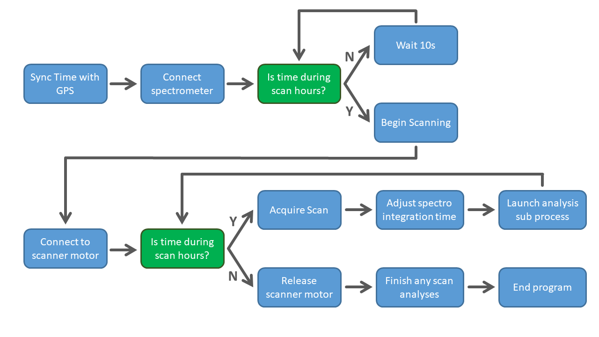

Station Software
================
This section will outline the function of the station software in order to allow users to adapt it to their needs and for different hardware.

run_scanner.py
--------------
This is the main program that controls the scanner. The figure below outlines the workflow of the main station program ``run_scanner.py``.

   
   Flowchart of the main station program
   
The ``run_scanner.py`` script should be launched when the Raspberry Pi boots and will perform a number of tasks before scanning begins. It is advised to have the Raspberry Pi be powered on for 1 - 2 hours either side of the scanning window to allow plenty of time for these tasks. The exact time that the station will turn on will depend on the power settings in the ``/home/pi/wittyPi/schedule.wpi`` file as described in :ref:`stationsetup`.

Additional Functions
--------------------
The main program calls additional functions in order to communicate with the various components of the scanner as a whole. These can be found in the ``openso2`` library within the main ``open_so2`` directory.

scanner.py
^^^^^^^^^^
Provides control of the scanner head.

``Scanner`` class
*****************
``Scanner`` is called by the main program to setup the stepper motor and microswitch of the scanner head. 

.. literalinclude:: ../../openso2/scanner.py
    :lines: 18-43
    
``acquire_scan``
****************
Function to acquire a scan. The head is first rotated to the home position where a dark spectrum is taken. The head is then rotated to the start position and the scan started. 

.. literalinclude:: ../../openso2/scanner.py
    :lines: 185-211
    
analyse_scan.py
^^^^^^^^^^^^^^^
Provides analysis of the completed scans

``analyse_scan``
****************
Function to analyse a scan block and save the results to file.

.. literalinclude:: ../../openso2/analyse_scan.py
    :lines: 84-103
    
``update_int_time``
*******************
Function to update the integration time of the spectrometer to adjust for changing light levels.

.. literalinclude:: ../../openso2/analyse_scan.py
    :lines: 165-183

call_gps.py
^^^^^^^^^^^
Provides functions to talk to the GPS

``sync_gps_time``
*****************
Function to sync the system time with GPS.

.. literalinclude:: ../../openso2/call_gps.py
    :lines: 14-26

program_setup.py
^^^^^^^^^^^^^^^^
Provides functions to initiate the program with the correct settings.

``read_settings``
*****************
Function to read in the settings from the ``data_bases/station_settings.txt`` file.

.. literalinclude:: ../../openso2/program_setup.py
    :lines: 14-34
    
julian_time.py
^^^^^^^^^^^^^^
Provides functions to easily convert between timestamps and decimal time.

``hms_to_julian``
*****************
Function to convert a timestamp to Julian time.

.. literalinclude:: ../../openso2/julian_time.py
    :lines: 15-36
    
    
    
    
    
    
    
    
    
    
    
    
    
    
    
    
